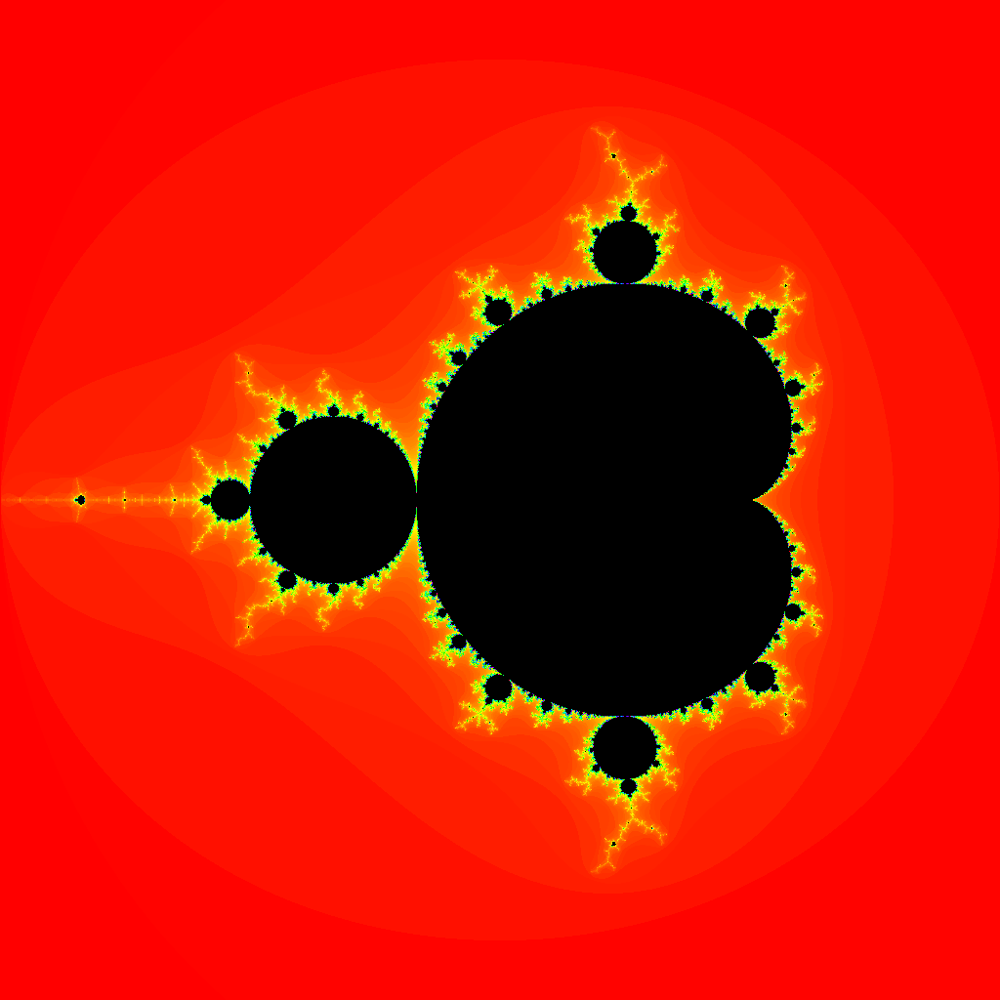
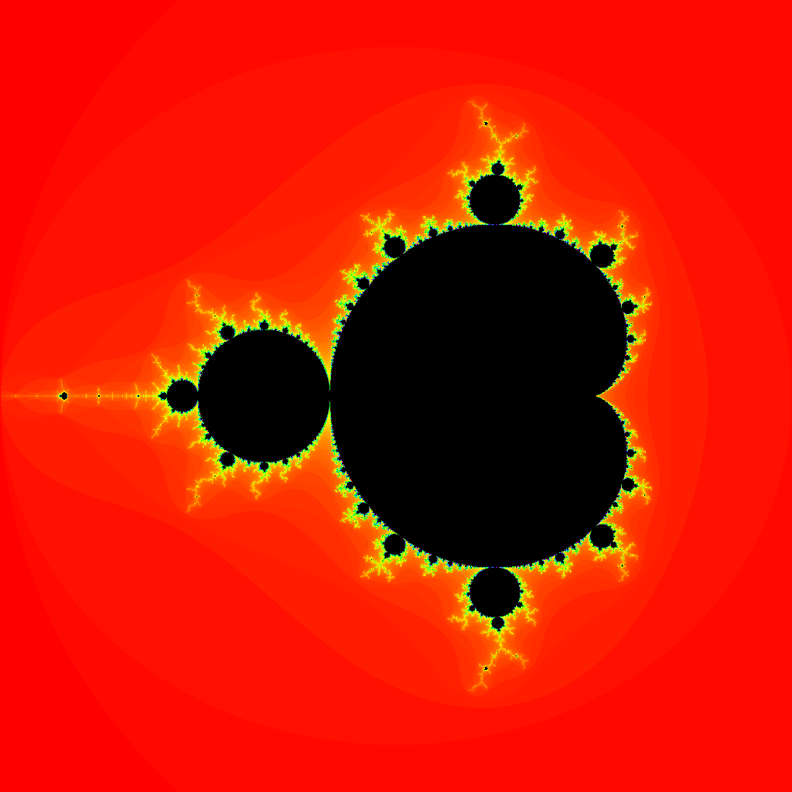
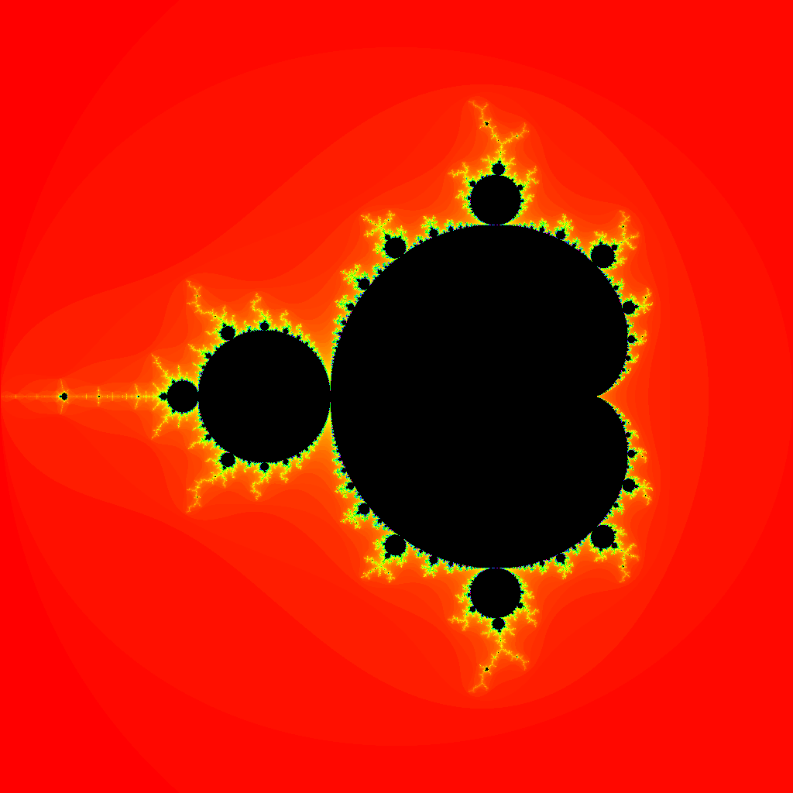

# Mandelbrot

Generate an image representing the mandelbrot set using **CUDA**, **OpenGL (Compute Shader)** and **OpenCL**.

## Results

Compute Shader                  | CUDA                           | OpenCL
:------------------------------:|:------------------------------:|:-------------------------:
|| 

## Comparative

Time in milliseconds againts image resolution.

||1024x1024|2048x2048|4096x4096|8192x8192|
|---|---|---|---|---|
|**CPU**|570|2,308|9,304|37,522|
|**CUDA**|63|83|188|644|
|**OpenCL**|77|94|202|681|
|**OpenGL**|19|63|264|884|

Speedup against image resolution (compared with CPU only time).

||1024x1024|2048x2048|4096x4096|8192x8192|
|---|---|---|---|---|
|**CUDA**|8|28|49|58|
|**OpenCL**|7|94|46|55|
|**OpenGL**|30|36|35|42|

## Considerations
 
 - Algorithm **max_depth** = 1024
 - Compiled using **g++** mode **Release** with **-O3** option.
 - CPU: Intel(R) Core(TM) i7-8565U 1.8GHz
 - GPU: Nvidia GeForce MX130

## License

This project is licensed under the GNU General Public License v3.0 - see the LICENSE file for details.